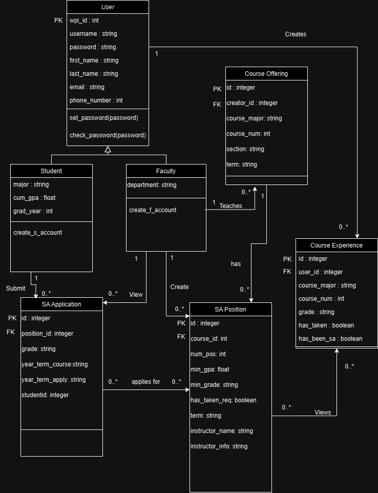
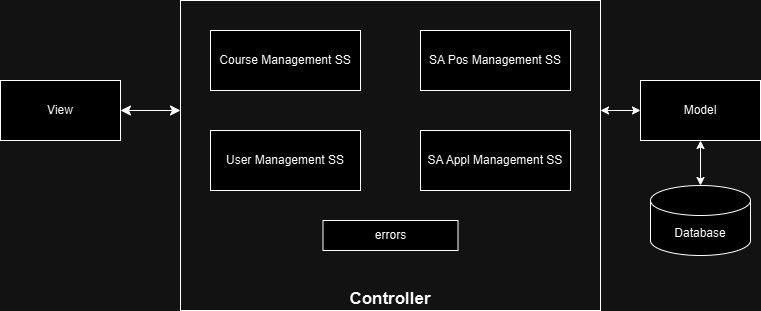

# Project Design Document - Final
## SA Connect: "Streamlining the Student Assistant Recruitment Process" 

--------
Prepared by:
* `Harleen Kaur`,`BME and RBE`
* `Julian Kreis`,`CS`
* `Jed Geoghegan`,`CS & DS`
* `Jacob Lu`,`IMGD & CS`
---
**Course** : CS 3733 - Software Engineering
**Instructor**: Sakire Arslan Ay
---
## Table of Contents
- [1. Introduction](#1-introduction)
- [2. Software Design](#2-software-design)
- [2.1 Database Model](#21-model)
- [2.2 Subsystems and Interfaces](#22-subsystems-and-interfaces)
- [2.2.1 Overview](#221-overview)
- [2.2.2 Interfaces](#222-interfaces)
- [2.3 User Interface Design](#23-view-and-user-interface-design)
- [3. References](#3-references)
- [Appendix: Grading Rubric](#appendix-grading-rubric)

### Document Revision History
| Name | Date | Changes | Version |
| ------ | ------ | --------- | --------- |
|Revision 1 |2024-11-15 |Initial draft | 1.0 |
|Revision 2 |2024-11-21 |Final draft |2.0 |

# 1. Introduction

This document describes the design of the Student Assistant Recruitment System for the WPI Computer Science Department. The purpose of this system is to manage student assistant (SA) applications, position creation, and assignment to students. This document provides a detailed software design including the database model, subsystem architectures, and user interface designs. This is the first revision, and we plan to add more specific details and examples in future drafts.

# 2. Software Design

## 2.1 Database Model

Classes
- User: The base class that stores common information for both students and instructors
- Student: stores information specific to students
- Faculty: stores information specific to faculty
- Course Offering: stores course offering details
- Course Experience: stores data about a student's previous experience in a course
- SA Position: stores details of available SA positions
- SA Application: stores details of SA applications

UML Diagram:
<kbd>
      
</kbd>

## 2.2 Subsystems and Interfaces
### 2.2.1 Overview
Describe the high-level architecture of your software: i.e., the major subsystems
and how they fit together. Provide a UML component diagram that illustrates the
architecture of your software. Briefly mention the role of each subsystem in your
architectural design. Please refer to the "System Level Design" lectures in Week 4.

Major subsystems:
- User Management Subsystem: ensures that both students and faculty can securely log in, access their profiles, and perform actions based on their role (student or faculty)

- Course Management Subsystem: responsible for managing course details, including course names, sections, and terms. It ensures that SA positions are linked to the correct course and course section.

- SA Position Management Subsystem: responsible for managing the creation, modification, and removal of student assistant (SA) positions. Faculty members can create SA positions by associating them with specific courses and defining the number of positions available.

- SA Application Management Subsystem: responsible for managing the student application process for SA positions. It enables students to apply for positions, track their application statuses, and withdraw applications.

UML Component:
<kbd>
      
</kbd>

### 2.2.2 Interfaces

#### 2.2.2.1 \User Management SS Routes
| | Methods | URL Path | Description |
|:--|:------------------|:-----------|:-------------|
|1. | POST | /student/register/ | registers a new user |
|2. | GET | /student/profile | retrieves the profile information of the logged-in user |
|3. | POST | /student/editprofile | edits a student's profile |

|4. | POST | /faculty/register/ | registers a new user |
|5. | GET | /faculty/profile | retrieves the profile information of the logged-in user |
|6. | POST | /faculty/editprofile | edits a faculty's profile |

|7. | POST | /login | authenticates and logs in user |
|8. | GET | /logout | ends a user session |

#### 2.2.2.2 \Course Management SS Routes
| | Methods | URL Path | Description |
|:--|:------------------|:-----------|:-------------|
|1. | POST | /course/create | creates a new course |
|2. | POST | /course/<course_id>/edit | edit an existing course |

#### 2.2.2.3 \Application Management SS Routes
| | Methods | URL Path | Description |
|:--|:------------------|:-----------|:-------------|
|1. | POST | /faculty/create | create SA positions|
|2. | GET | /faculty/positions | displays list of all SA positions created |
|3. | POST | /faculty/<position_id>/edit | edit SA positon |
|4. | GET | /student/positions | displays list of all available SA positions |
|5. | GET | /student/positions/recommendations | retrieves a list of recommended positions for the student based on interest |

### 2.3 User Interface Design

Page Tempates: 
- Staff: Index page shows courses they've created, can open dropdown under each course that shows applicants and applicant info. Each course also has an edit button to go to an edit course form. Create course page, Edit course form.

- Student: Index page shows courses they can apply to, including a separate relevant courses section. Separate page to view application status

- Both: Login Page, Profile creation page, Edit Profile (Student will need some info than what is stored in faculty)

User Stories:
- Student: 3-9
- Staff: 12-16
- Both: 1-2, 10-11

1. As a student, I want to create an account using my WPI credentials so that I can log in an apply for SA positions.  
2. As a student, I want to login with username and password provided during create account
3. As a student, I want to view all SA positions so that I can choose positions of interest.  
4. As a student, I want to view a list of recommended positions so that I can find relevant opportunities.  
5. As a student, I want to view a detailed description of a position so that I can understand the requirements for each course.  
6. As a student, I want to apply to SA positions so that I can get a job.  
7. As a student, I want to view the status of my applications so that I can track my SA application progress. 
8. As a student, I want to withdraw my application for a SA position so that I can change my decision to be a SA.  
9. As a student, I want to have "assigned" SA positions be disabled for withdrawal so I can't withdraw from "assigned" positions.
10. As a student, I want to edit my profile so that I can change my personal information 
11. As faculty, I want to create an account using my WPI credentials so that I can log in and hire students. 
12. As faculty, I want to login with username and password provided during create account
13. As faculty, I want to add courses with open SA positions so that I can add positions.  
14. As faculty, I want to add open SA positions for my courses so that I can begin the hiring process.  
15. As faculty, I want to view student applications so that I can review qualifications and hire applicants.  
16. As faculty, I want to assign SA positions based on student applications and qualifications, ensuring each student is only assigned to a single position. 
17. As faculty, after interviewing a student, I would like to update the status of their application from “Pending” to "Assigned" so that I can hire them for the position. 
18. As a faculty, I want to edit my profile so that I can change my personal information 

# 3. References
Cite your references here.
For the papers you cite give the authors, the title of the article, the journal
name, journal volume number, date of publication and inclusive page numbers. Giving
only the URL for the journal is not appropriate.
For the websites, give the title, author (if applicable) and the website URL.

----
# Appendix: Grading Rubric
(Please remove this part in your final submission)
* You will first submit a draft version of this document:
* "Project 3 : Project Design Document - draft" (5pts).
* We will provide feedback on your document and you will revise and update it.
* "Project 5 : Project Design Document - final" (80pts)
Below is the grading rubric that we will use to evaluate the final version of your
document.
|**MaxPoints**| **Design** |
|:---------:|:---------------------------------------------------------------------
----|
| | Are all parts of the document in agreement with the product
requirements? |
| 8 | Is the architecture of the system ([2.2.1 Overview](#221-overview))
described well, with the major components and their interfaces?
| 8 | Is the database model (i.e., [2.1 Database Model](#21-database-model))
explained well with sufficient detail? Do the team clearly explain the purpose of
each table included in the model?|
| | Is the document making good use of semi-formal notation (i.e., UML
diagrams)? Does the document provide a clear UML class diagram visualizing the DB
model of the system? |
| 18 | Is the UML class diagram complete? Does it include all classes
(tables) and does it clearly mark the PK and FKs for each table? Does it clearly
show the associations between them? Are the multiplicities of the associations
shown correctly? ([2.1 Database Model](#21-database-model)) |
| 25 | Are all major interfaces (i.e., the routes) listed? Are the routes
explained in sufficient detail? ([2.2.2 Interfaces](#222-interfaces)) |
| 13 | Is the view and the user interfaces explained well? Did the team
provide the screenshots of the interfaces they built so far. ([2.3 User Interface
Design](#23-user-interface-design)) |
| | **Clarity** |
| | Is the solution at a fairly consistent and appropriate level of
detail? Is the solution clear enough to be turned over to an independent group for
implementation and still be understood? |
| 5 | Is the document carefully written, without typos and grammatical
errors? |
| 3 | Is the document well formatted? (Make sure to check your document on
GitHub. You will loose points if there are formatting issues in your document. )
|
| | |
| 80 | **Total** |
| | |
